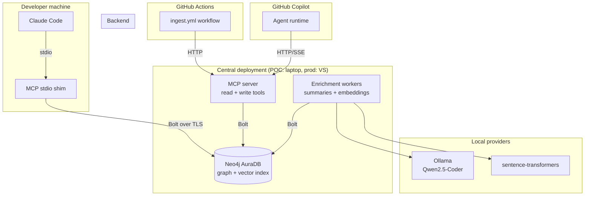

# Code Knowledge Graph — Technical Design

**Status:** Draft v1, ready for implementation
**Target consumer:** Claude Code (build), Claude Code + GitHub Copilot (runtime)
**POC target repo:** https://github.com/deepu-roy/DevOnHire (Angular/TS + .NET/C# + markdown)

---

## 1. Overview

### 1.1 Problem

Code knowledge graphs generated by tools like Understand-Anything ship as a single static JSON file. Querying that file via grep is slow, token-expensive, and gets worse with scale. At enterprise scale across multiple squads, we need:

- A queryable backend that handles multi-hop graph traversal cheaply.
- Token-efficient, typed retrieval (no raw-JSON dumps into LLM context).
- Incremental updates tied to git, not full rebuilds.
- A unified surface for code AND in-repo documentation.
- Provider-agnostic LLM/embedding usage (local for dev, remote for scale).
- Native multi-repo support with cross-repo dependency analysis.

### 1.2 Goals (v1)

- Ingest one repo (Angular + .NET + markdown) into a graph backend.
- Expose typed tools via MCP (stdio + HTTP transports).
- Power impact analysis, test discovery, semantic code search, and doc↔code linkage.
- Update incrementally from a GitHub Actions workflow on push.
- Run entirely on free/local resources for POC (Aura Free + local Ollama).

### 1.3 Non-goals (v1)

- Authentication / RBAC (deferred until v2).
- Cross-repo edges (schema supports it; inference logic ships in v2).
- Web UI / graph visualization (Neo4j Browser is enough for POC).
- Real-time updates (push-triggered CI is enough; no LSP-style hot reload).
- Languages beyond TS/Angular and C#/.NET.

### 1.4 Tech stack

| Concern | Choice | Rationale |
|---|---|---|
| Graph store | **Neo4j AuraDB Free** (POC) → Neo4j Community (prod) | Native multi-hop traversal, built-in vector indexes (5.11+), one DB for graph + vectors |
| AST parser | **tree-sitter** (Python bindings) | Language-agnostic, incremental, ecosystem-standard |
| Summary LLM (default) | **Ollama + Qwen2.5-Coder 14B** | Local, free, strong on code; M4 + 42GB RAM is plenty |
| Summary LLM (alt) | OpenAI gpt-4o-mini, Copilot models via API | Pluggable provider |
| Embedding (default) | **sentence-transformers (BAAI/bge-small-en-v1.5)** | Local, 384-dim, fast, good quality |
| Embedding (alt) | OpenAI text-embedding-3-small | Pluggable provider |
| MCP server | **Python + FastMCP** | Aligned with Anthropic's MCP Python SDK |
| MCP transports | stdio + streamable HTTP | Claude Code (stdio), Copilot (HTTP), central deploy (HTTP) |
| CI | GitHub Actions | Your existing stack |
| Containerization | Docker + docker-compose | POC portability across Mac/Windows |
| Config/CLI | Pydantic Settings + Typer | Standard Python ecosystem |

---

## 2. Architecture

### 2.1 Component diagram



### 2.2 Data flow

**Ingestion path** (CI-driven, triggered on push):
1. GitHub Actions workflow checks out the repo and the previous analyzed commit SHA from Neo4j.
2. Workflow calls MCP write tool `ingest_repo(repo, commit_sha, base_commit_sha?)`.
3. Server clones/fetches the repo, runs diff against `base_commit_sha`.
4. For each changed file: parse with tree-sitter → normalize to internal node/edge model.
5. Enrichment pass: generate summaries (Ollama) + embeddings (sentence-transformers) for new/changed nodes only.
6. Upsert nodes/edges into Neo4j (idempotent, keyed on stable IDs).
7. Soft-delete orphaned nodes (last_seen_commit < current).
8. Update repo metadata (last commit SHA, last ingest timestamp).

**Query path** (dev workflow):
1. Developer asks Claude Code "what calls `CandidateService.create`?"
2. Claude Code invokes MCP tool `impact_analysis(node_id="function:devonhire:.../candidate.service.ts:create")`.
3. MCP server runs parameterized Cypher, gets upstream callers + downstream effects + linked tests.
4. Response shaped to terse format (id, name, summary, edge_type) → returned as `structuredContent`.
5. Claude Code synthesizes answer using returned subgraph (typically 5–50 nodes, ~1–3KB).

---

## 3. Neo4j schema

### 3.1 Node labels

Every node carries a **primary label** (what it is) and a **repo label** (`Repo_<RepoName>`) for cheap repo filtering. Code nodes also carry the cross-cutting `:CodeNode` label; docs carry `:DocNode`.

| Primary label | Meaning | Example ID |
|---|---|---|
| `:Repo` | Repository root | `repo:devonhire` |
| `:File` | Source file | `file:devonhire:src/app/app.module.ts` |
| `:Module` | Language module / namespace | `module:devonhire:DevOnHire.Web.AppModule` |
| `:Class` | Class declaration | `class:devonhire:src/.../candidate.service.ts:CandidateService` |
| `:Interface` | Interface declaration | `interface:devonhire:src/.../ICandidate.cs:ICandidate` |
| `:Function` | Top-level function / arrow function | `function:devonhire:src/.../utils.ts:formatDate:1a2b` |
| `:Method` | Method on a class | `method:devonhire:src/.../candidate.service.ts:CandidateService:create:9f8e` |
| `:Enum` | Enum declaration | `enum:devonhire:src/.../status.ts:CandidateStatus` |
| `:Endpoint` | HTTP endpoint (controller action) | `endpoint:devonhire:GET:/api/candidates` |
| `:Document` | Markdown document | `doc:devonhire:README.md` |
| `:Section` | Heading section in a document | `doc:devonhire:README.md#installation` |
| `:Concept` | LLM-extracted concept tag | `concept:devonhire:authentication` |
| `:Layer` | Architectural layer | `layer:devonhire:frontend-ui` |

### 3.2 Common node properties

All nodes:
- `id: string` (unique, see §3.4)
- `name: string`
- `repo: string`
- `summary: string` (LLM-generated, 1–3 sentences)
- `tags: string[]`
- `summary_embedding: float[]` (vector, 384-dim for bge-small)
- `complexity: string` (simple/moderate/complex, from heuristic + LLM)
- `first_seen_commit: string`
- `last_seen_commit: string`
- `created_at: datetime`
- `updated_at: datetime`

Code-specific (`:CodeNode`):
- `filePath: string`
- `language: string` (`typescript`, `csharp`, `javascript`)
- `lineRange: [int, int]`
- `signature: string` (functions/methods)
- `signature_hash: string` (for ID stability under refactors)
- `file_hash: string` (content hash of containing file)
- `code_snippet: string` (truncated, for summary regeneration)

Document-specific (`:DocNode`):
- `filePath: string`
- `heading: string` (sections only)
- `level: int` (heading level, sections only)
- `content: string` (truncated)
- `content_hash: string`

### 3.3 Relationship types

| Type | From → To | Direction | Notes |
|---|---|---|---|
| `CONTAINS` | `:File` → `:Class\|:Function\|:Method` | Structural | File-scope membership |
| `DEFINES` | `:Class` → `:Method`, `:Class` → `:Property` | Structural | Class-scope membership |
| `IMPORTS` | `:File` → `:File\|:Module` | Forward | Resolved import |
| `CALLS` | `:Function\|:Method` → `:Function\|:Method` | Forward | Function call |
| `INSTANTIATES` | `:Function\|:Method` → `:Class` | Forward | `new X()` |
| `EXTENDS` | `:Class` → `:Class` | Forward | Inheritance |
| `IMPLEMENTS` | `:Class` → `:Interface` | Forward | Interface impl |
| `REFERENCES` | `:CodeNode` → `:CodeNode` | Forward | Symbol reference (not call/import) |
| `EXPOSES_ENDPOINT` | `:Method` → `:Endpoint` | Forward | .NET controller action |
| `CALLS_HTTP` | `:Method\|:Function` → `:Endpoint` | Forward | Inferred frontend→backend (v2) |
| `BELONGS_TO_LAYER` | `:CodeNode` → `:Layer` | Forward | Layer membership |
| `DOCUMENTS` | `:Document\|:Section` → `:CodeNode` | Forward | Doc explicitly references code |
| `MENTIONS` | `:Document\|:Section` → `:Concept\|:CodeNode` | Forward | Fuzzy mention (LLM-inferred) |
| `LINKS_TO` | `:Document` → `:Document` | Forward | Markdown cross-link |
| `HAS_SECTION` | `:Document` → `:Section` | Structural | Heading containment |
| `IN_REPO` | any → `:Repo` | Backward | Cheap repo membership query |
| `TESTS` | `:Method\|:Function` → `:Method\|:Function` | Forward | Test → subject under test (heuristic) |

All relationships carry:
- `weight: float` (confidence; 1.0 for AST-derived, <1.0 for inferred)
- `first_seen_commit: string`
- `last_seen_commit: string`

### 3.4 Stable ID scheme

Stability under refactors is critical so updates don't churn the graph.

| Node type | ID template | Stability strategy |
|---|---|---|
| Repo | `repo:<slug>` | Manual slug |
| File | `file:<repo>:<path>` | Path-based. Renames produce new ID + soft-delete old; alias edge `RENAMED_FROM` connects them when rename is detected via similarity heuristic. |
| Class | `class:<repo>:<path>:<name>` | Path + name |
| Function/Method | `function\|method:<repo>:<path>:[<class>:]<name>:<sighash>` | Path + name + sig-hash (handles overloads & disambiguates renames) |
| Endpoint | `endpoint:<repo>:<verb>:<route_template>` | Verb + route template; survives file moves |
| Document | `doc:<repo>:<path>` | Path-based |
| Section | `doc:<repo>:<path>#<slug-of-heading>` | Path + heading slug |
| Layer | `layer:<repo>:<slug>` | LLM/heuristic-assigned slug |
| Concept | `concept:<repo>:<slug>` | LLM-extracted normalized form |

`<sighash>` = first 4 chars of SHA-1 of normalized signature (param types, return type).

### 3.5 Indexes & constraints

```cypher
// Uniqueness constraints (one per node label)
CREATE CONSTRAINT file_id IF NOT EXISTS FOR (n:File) REQUIRE n.id IS UNIQUE;
CREATE CONSTRAINT class_id IF NOT EXISTS FOR (n:Class) REQUIRE n.id IS UNIQUE;
CREATE CONSTRAINT function_id IF NOT EXISTS FOR (n:Function) REQUIRE n.id IS UNIQUE;
CREATE CONSTRAINT method_id IF NOT EXISTS FOR (n:Method) REQUIRE n.id IS UNIQUE;
CREATE CONSTRAINT endpoint_id IF NOT EXISTS FOR (n:Endpoint) REQUIRE n.id IS UNIQUE;
CREATE CONSTRAINT document_id IF NOT EXISTS FOR (n:Document) REQUIRE n.id IS UNIQUE;
CREATE CONSTRAINT section_id IF NOT EXISTS FOR (n:Section) REQUIRE n.id IS UNIQUE;
CREATE CONSTRAINT layer_id IF NOT EXISTS FOR (n:Layer) REQUIRE n.id IS UNIQUE;
CREATE CONSTRAINT concept_id IF NOT EXISTS FOR (n:Concept) REQUIRE n.id IS UNIQUE;
CREATE CONSTRAINT repo_id IF NOT EXISTS FOR (n:Repo) REQUIRE n.id IS UNIQUE;

// B-tree indexes on hot filter properties
CREATE INDEX node_repo IF NOT EXISTS FOR (n:CodeNode) ON (n.repo);
CREATE INDEX node_filepath IF NOT EXISTS FOR (n:CodeNode) ON (n.filePath);
CREATE INDEX node_last_seen IF NOT EXISTS FOR (n:CodeNode) ON (n.last_seen_commit);
CREATE INDEX doc_repo IF NOT EXISTS FOR (n:DocNode) ON (n.repo);

// Full-text indexes for keyword search
CREATE FULLTEXT INDEX code_search IF NOT EXISTS
  FOR (n:CodeNode) ON EACH [n.name, n.summary, n.signature];
CREATE FULLTEXT INDEX doc_search IF NOT EXISTS
  FOR (n:DocNode) ON EACH [n.name, n.summary, n.content, n.heading];

// Vector indexes (Neo4j 5.11+) — 384 dims for bge-small, 1536 for openai-3-small
CREATE VECTOR INDEX code_embeddings IF NOT EXISTS
  FOR (n:CodeNode) ON (n.summary_embedding)
  OPTIONS {indexConfig: {`vector.dimensions`: 384, `vector.similarity_function`: 'cosine'}};
CREATE VECTOR INDEX doc_embeddings IF NOT EXISTS
  FOR (n:DocNode) ON (n.summary_embedding)
  OPTIONS {indexConfig: {`vector.dimensions`: 384, `vector.similarity_function`: 'cosine'}};
```

> Vector index dimensions must match the embedding provider. The dimension is read from config at bootstrap; the schema migration step re-creates the index if the dim changes (with a one-time re-embed).

---

## 4. Provider abstractions

Everything pluggable lives behind a `Protocol`. Concrete providers are selected via `config.providers.*`. Adding a new provider = one class + one config entry.

### 4.1 Embedding provider

```python
# src/code_kg/providers/embedding/base.py
from typing import Protocol

class EmbeddingProvider(Protocol):
    name: str
    dimensions: int

    async def embed(self, texts: list[str]) -> list[list[float]]:
        """Batch-embed a list of strings. Returns vectors of length `dimensions`."""
        ...

    async def embed_one(self, text: str) -> list[float]:
        ...
```

Implementations:
- `SentenceTransformersProvider` — model name from config (default `BAAI/bge-small-en-v1.5`, 384 dims).
- `OpenAIProvider` — model name from config (default `text-embedding-3-small`, 1536 dims).

### 4.2 Summary provider

```python
# src/code_kg/providers/summary/base.py
from typing import Protocol
from code_kg.domain.models import SummaryRequest, SummaryResponse

class SummaryProvider(Protocol):
    name: str
    model_version: str  # for cache invalidation

    async def summarize(self, request: SummaryRequest) -> SummaryResponse:
        """Generate summary + tags + complexity for a code or doc node."""
        ...
```

`SummaryRequest`: node_type, name, language, code_or_text, context (parent class, imports, neighbors).
`SummaryResponse`: summary (1–3 sentences), tags (3–8), complexity (simple/moderate/complex).

Implementations:
- `OllamaProvider` — talks to a local Ollama at `http://localhost:11434`, configurable model (default `qwen2.5-coder:14b`).
- `OpenAIProvider` — OpenAI-compatible chat completions (works for OpenAI and Copilot API).

Both implementations use the **same prompts** (templated in `providers/summary/prompts.py`) and the **same structured-output contract** (JSON schema enforced via response format / function calling).

### 4.3 Ingestion source

```python
# src/code_kg/ingestion/sources/base.py
from typing import Protocol, AsyncIterator
from code_kg.domain.models import RawNode, RawEdge

class IngestionSource(Protocol):
    name: str
    supported_extensions: list[str]

    async def extract(self, repo_root: Path, files: list[Path]) -> AsyncIterator[RawNode | RawEdge]:
        """Yield nodes and edges extracted from the given files. Pure AST → graph transformation, no LLM."""
        ...
```

Implementations (v1):
- `TypeScriptSource` — tree-sitter-typescript, captures classes/functions/methods/imports/calls/decorators (Angular `@Component`, `@Injectable`).
- `CSharpSource` — tree-sitter-c-sharp, captures classes/methods/interfaces/usings + `[Route]`/`[HttpGet]`/etc. → `:Endpoint` nodes.
- `MarkdownSource` — `markdown-it-py`, captures documents + sections + cross-links.

### 4.4 LLM client (shared)

`providers/llm/client.py` wraps OpenAI-compatible chat completions (Ollama and OpenAI both speak this dialect). Used by `SummaryProvider` implementations. Concentrates retry/backoff/timeout/usage-tracking in one place.

### 4.5 Configuration

```python
# src/code_kg/config.py
from pydantic_settings import BaseSettings, SettingsConfigDict

class Neo4jSettings(BaseSettings):
    uri: str
    user: str
    password: str
    database: str = "neo4j"

class EmbeddingSettings(BaseSettings):
    provider: Literal["sentence_transformers", "openai"] = "sentence_transformers"
    model: str = "BAAI/bge-small-en-v1.5"
    api_key: str | None = None
    batch_size: int = 32

class SummarySettings(BaseSettings):
    provider: Literal["ollama", "openai"] = "ollama"
    base_url: str = "http://localhost:11434"
    model: str = "qwen2.5-coder:14b"
    api_key: str | None = None
    temperature: float = 0.1
    max_concurrent: int = 4

class Settings(BaseSettings):
    model_config = SettingsConfigDict(env_file=".env", env_nested_delimiter="__")
    neo4j: Neo4jSettings
    embedding: EmbeddingSettings = EmbeddingSettings()
    summary: SummarySettings = SummarySettings()
    mcp_transport: Literal["stdio", "http"] = "stdio"
    mcp_http_host: str = "127.0.0.1"
    mcp_http_port: int = 8765
    log_level: str = "INFO"
```

`.env` example:
```
NEO4J__URI=neo4j+s://xxxxx.databases.neo4j.io
NEO4J__USER=neo4j
NEO4J__PASSWORD=<secret>
EMBEDDING__PROVIDER=sentence_transformers
EMBEDDING__MODEL=BAAI/bge-small-en-v1.5
SUMMARY__PROVIDER=ollama
SUMMARY__MODEL=qwen2.5-coder:14b
SUMMARY__BASE_URL=http://localhost:11434
MCP_TRANSPORT=stdio
```

Swap to OpenAI:
```
EMBEDDING__PROVIDER=openai
EMBEDDING__MODEL=text-embedding-3-small
EMBEDDING__API_KEY=sk-...
SUMMARY__PROVIDER=openai
SUMMARY__MODEL=gpt-4o-mini
SUMMARY__BASE_URL=https://api.openai.com/v1
SUMMARY__API_KEY=sk-...
```

---

## 5. Ingestion pipeline

### 5.1 Pipeline stages

```
clone/fetch → diff → parse → normalize → enrich → upsert → cleanup
```

1. **Clone/fetch** — shallow clone if absent, otherwise `git fetch + checkout <commit_sha>`. Working copy in `/tmp/code-kg/<repo-slug>/<commit_sha>`.
2. **Diff** — `git diff --name-status <base_sha> <commit_sha>` → `(added, modified, deleted, renamed)` sets. On first ingest (no base), all files are `added`.
3. **Parse** — route each file to its `IngestionSource` by extension. Each source emits `RawNode` and `RawEdge` objects. AST parsing is the hot path; parallelized across files.
4. **Normalize** — assign stable IDs, resolve cross-file references (e.g., import targets → file IDs), compute file/signature hashes. Output: `NormalizedNode` and `NormalizedEdge`.
5. **Enrich** — for new or content-hash-changed nodes only:
   - Generate summary via `SummaryProvider` (concurrent, capped by `summary.max_concurrent`).
   - Generate embedding via `EmbeddingProvider` (batched).
   - Existing nodes whose content didn't change: skip both steps (huge cost saving).
6. **Upsert** — transactional Cypher `MERGE` keyed on `id`. Update `last_seen_commit` on every match. Insert new relationships, update properties.
7. **Cleanup** — soft-delete: set `deleted_at` on nodes/edges where `last_seen_commit != current_commit` and `repo = <repo>`. Actual `DELETE` is a separate periodic task (keeps history queryable).

### 5.2 Tree-sitter capture queries

Stored in `src/code_kg/ingestion/queries/`. One `.scm` file per language.

**TypeScript example** (`typescript.scm`, abbreviated):
```scheme
; classes
(class_declaration name: (type_identifier) @class.name) @class.def

; methods
(method_definition name: (property_identifier) @method.name) @method.def

; arrow function exported as const
(export_statement (lexical_declaration
  (variable_declarator name: (identifier) @function.name
    value: (arrow_function)))) @function.def

; calls
(call_expression function: [
  (identifier) @call.name
  (member_expression property: (property_identifier) @call.name)
]) @call.site

; imports
(import_statement source: (string (string_fragment) @import.path)) @import.def

; Angular decorators
(decorator (call_expression function: (identifier) @decorator.name
  arguments: (arguments (object) @decorator.args))) @decorator.def
```

**C# example** (`csharp.scm`, abbreviated):
```scheme
(class_declaration name: (identifier) @class.name) @class.def
(method_declaration name: (identifier) @method.name) @method.def
(invocation_expression function: [
  (identifier) @call.name
  (member_access_expression name: (identifier) @call.name)
]) @call.site
(using_directive (qualified_name) @using.path) @using.def

; HTTP attributes
(attribute name: (identifier) @attr.name
  (#match? @attr.name "^(HttpGet|HttpPost|HttpPut|HttpDelete|Route)$")) @attr.def
```

### 5.3 Resolving calls and imports

AST alone gives us *unresolved* call sites (just function names). To convert to graph edges we need scope resolution:

1. **Per-file symbol table** — built in normalize stage. Maps local names → fully-qualified IDs.
2. **Import resolution** — TS module paths → file IDs (handles `~/`, `@/` aliases via `tsconfig.json` paths). C# `using` → namespace; namespaces → file IDs via a namespace registry built in pass 1.
3. **Call resolution** — two passes:
   - Pass 1: build the symbol & namespace registry across all files.
   - Pass 2: resolve calls against the registry. Unresolved calls become edges with `weight: 0.5` and `unresolved: true` (still useful for fuzzy matching, doesn't pollute strict queries).

### 5.4 Markdown ingestion

`MarkdownSource` produces:
- One `:Document` per `.md` file.
- One `:Section` per heading (H1–H4), linked via `HAS_SECTION`.
- `LINKS_TO` edges for `[text](other-doc.md)` links.
- For each section, after enrichment: `MENTIONS` edges to code symbols whose name appears in the section text (case-sensitive whole-word match against the symbol registry built during code ingestion).
- LLM-inferred `DOCUMENTS` edges in a v1.5 pass: prompt the summary LLM with "Given this section and these candidate code symbols [top-K from name match + vector similarity], pick the ones this section actually describes."

### 5.5 Layer assignment

Two-stage:
1. **Heuristic** — path-pattern rules in `src/code_kg/ingestion/layers.py`. e.g. `src/.../components/**/*.ts` → `frontend-ui`, `src/.../*Controller.cs` → `backend-api`. Configurable per repo via `.code-kg.yml`.
2. **LLM fallback** — for unmatched files, batch them and ask the summary LLM to assign one of the existing layers (or propose a new one). Confirmed layers are persisted in the per-repo config.

### 5.6 Test mapping

`TESTS` edges are inferred (not AST-derived) since they cross naming conventions. Strategy:
- File is a test if path matches `**/*.spec.ts`, `**/*.test.ts`, `**/*Tests.cs`, or contains `[Test]`/`[Fact]` attributes.
- Test method → subject mapping by:
  1. Description match (`describe('CandidateService')` → look up class).
  2. Symbol match (test body calls one or more methods of the subject — pick the most-called).
  3. Path mirroring (`src/foo/bar.ts` ↔ `src/foo/bar.spec.ts` or `tests/foo/bar.spec.ts`).
- Each candidate scored; edges emitted with weight = score. Multiple `TESTS` edges per test are fine.

### 5.7 Cost & runtime budget (POC sizing)

For DevOnHire (~few hundred files):
- Parse + normalize: <30s on M4.
- Embeddings (sentence-transformers, ~2k nodes, batched): ~10–20s.
- Summaries (Qwen2.5-Coder 14B, ~2k nodes, concurrency 4): ~15–25 minutes on first run.
- Upsert into Aura Free: ~1–2 minutes.
- **Incremental rerun on a typical 5-file PR**: ~30s end-to-end.

Aura Free limits: 200k nodes / 400k relationships. Plenty for one mid-sized repo.

---

## 6. MCP server

### 6.1 Server lifecycle

```python
# src/code_kg/mcp/server.py
from mcp.server.fastmcp import FastMCP
from code_kg.config import Settings
from code_kg.graph.client import Neo4jClient

settings = Settings()
graph = Neo4jClient(settings.neo4j)
mcp = FastMCP("code-kg", dependencies=[...])

# tools registered from code_kg.mcp.tools.{read,write}
register_read_tools(mcp, graph)
register_write_tools(mcp, graph, settings)

if __name__ == "__main__":
    if settings.mcp_transport == "stdio":
        mcp.run("stdio")
    else:
        mcp.run("streamable-http", host=settings.mcp_http_host, port=settings.mcp_http_port)
```

### 6.2 Read tools

Each tool defines a Pydantic input model, a Pydantic output model (for `structuredContent`), and carries appropriate hints. **All read tools have `readOnlyHint=True`.** Responses are token-shaped (see §6.4).

#### `find_nodes`
**Purpose:** primary discovery tool. Hybrid keyword + vector search.

```python
class FindNodesInput(BaseModel):
    query: str
    types: list[str] | None = None       # filter by primary label, e.g. ["Function", "Method"]
    repos: list[str] | None = None
    layers: list[str] | None = None
    limit: int = 10
    use_semantic: bool = True            # if False, full-text only

class FoundNode(BaseModel):
    id: str
    type: str
    name: str
    filePath: str | None
    summary: str
    tags: list[str]
    layer: str | None
    score: float                         # blended score

class FindNodesOutput(BaseModel):
    nodes: list[FoundNode]
    total_matched: int
```

Implementation: parallel full-text search and vector search; reciprocal-rank-fusion the two ranked lists; filter by repos/types/layers.

#### `get_node`
**Purpose:** detailed view of one node + immediate neighbors.

```python
class GetNodeInput(BaseModel):
    id: str
    include_neighbors: bool = True
    neighbor_edge_types: list[str] | None = None
    max_neighbors: int = 20

class NodeDetail(BaseModel):
    id: str
    type: str
    name: str
    summary: str
    tags: list[str]
    layer: str | None
    filePath: str | None
    lineRange: tuple[int, int] | None
    signature: str | None
    neighbors: list[NeighborRef]
```

#### `get_neighbors`
**Purpose:** traversal — multi-hop variant of get_node.

```python
class GetNeighborsInput(BaseModel):
    id: str
    edge_types: list[str] | None = None  # e.g. ["CALLS", "IMPORTS"]
    direction: Literal["in", "out", "both"] = "both"
    depth: int = 1                       # 1..4
    limit_per_hop: int = 25
```

Returns adjacency layers — keeps response shape compact.

#### `impact_analysis`
**Purpose:** the headline use case. Given a node, return:
- Upstream callers (who depends on this) — up to N hops.
- Downstream callees (what this depends on) — up to N hops.
- Tests covering this node.
- Documents referencing this node.
- Layer and cross-layer breakdown.

```python
class ImpactAnalysisInput(BaseModel):
    id: str
    max_depth: int = 3
    include_tests: bool = True
    include_docs: bool = True

class ImpactAnalysisOutput(BaseModel):
    target: FoundNode
    upstream: list[ImpactPath]           # callers, with path
    downstream: list[ImpactPath]         # callees, with path
    tests: list[FoundNode]
    docs: list[FoundNode]
    layer_breakdown: dict[str, int]      # how many affected nodes per layer
```

#### `trace_call_chain`
**Purpose:** find paths between two nodes.

```python
class TraceCallChainInput(BaseModel):
    from_id: str
    to_id: str
    max_depth: int = 6
    edge_types: list[str] = ["CALLS", "INSTANTIATES"]
```

Cypher: `MATCH p = shortestPath((a {id:$from})-[:CALLS|INSTANTIATES*..6]->(b {id:$to})) RETURN p`.

#### `find_tests_for`
```python
class FindTestsForInput(BaseModel):
    id: str
    min_weight: float = 0.5
```

Returns test nodes connected by `TESTS` edges, sorted by weight.

#### `find_docs_for` / `find_code_for`
Cross-domain bridges.

#### `semantic_search`
**Purpose:** pure vector search (when keyword wouldn't work — natural language phrasing).

```python
class SemanticSearchInput(BaseModel):
    query: str
    scope: Literal["code", "docs", "all"] = "all"
    top_k: int = 10
    repos: list[str] | None = None
```

#### `get_layer` / `list_layers`
Layer enumeration and membership.

#### `diff_subgraph`
**Purpose:** "what changed between commit A and commit B."

```python
class DiffSubgraphInput(BaseModel):
    repo: str
    base_commit: str
    head_commit: str
    scope: Literal["all", "code", "docs"] = "all"

class DiffSubgraphOutput(BaseModel):
    added: list[FoundNode]
    removed: list[FoundNode]
    modified: list[FoundNode]            # content_hash changed
    summary: str                         # one-paragraph diff description
```

### 6.3 Write tools

All write tools have `readOnlyHint=False`, `idempotentHint=True` (where applicable), `destructiveHint` set accurately.

#### `ingest_repo`
**Purpose:** primary entry point for CI.

```python
class IngestRepoInput(BaseModel):
    repo_url: str                        # https://github.com/...
    repo_slug: str                       # stable identifier
    commit_sha: str
    base_commit_sha: str | None = None   # if None, do full ingest
    branch: str = "main"
    force_full: bool = False
    layers_config_path: str | None = None  # path to .code-kg.yml inside repo

class IngestRepoOutput(BaseModel):
    job_id: str
    status: Literal["completed", "queued", "failed"]
    nodes_added: int
    nodes_modified: int
    nodes_removed: int
    edges_added: int
    edges_removed: int
    duration_seconds: float
    errors: list[str]
```

Annotations: `destructiveHint=True` (replaces graph state).

#### `reindex_file`
Single-file refresh — useful for dev override.
```python
class ReindexFileInput(BaseModel):
    repo: str
    file_path: str
    commit_sha: str | None = None        # if None, use repo's current
```

#### `refresh_summaries` / `refresh_embeddings`
Re-run enrichment, e.g. after upgrading the model.
```python
class RefreshEnrichmentInput(BaseModel):
    repo: str | None = None              # None = all repos
    node_ids: list[str] | None = None    # None = all matching repo
    only_if_missing: bool = True         # default: skip nodes that already have a value
```

#### `delete_repo`
Hard-delete a repo's namespace. `destructiveHint=True`.

#### `apply_graph_patch`
Low-level escape hatch. Accepts a structured node/edge diff. Used internally by `ingest_repo`; exposed for advanced repair scenarios.

### 6.4 Response shaping

LLM clients pay for every token they read. Default response shaping rules:

1. **Never return embeddings.** Strip `summary_embedding` from every response.
2. **Truncate `summary` to 280 chars** in list responses; full summary only in `get_node`.
3. **Drop `code_snippet`** unless explicitly requested via `include_code: True`.
4. **Cap list sizes** by `limit` parameter; include `total_matched` so the LLM knows what got cut.
5. **Use stable, short field names** — `id`, `name`, `type`, not `node_identifier`, `display_name`, `node_type`.
6. **Structured output via `structuredContent`** — Pydantic models serialized as JSON; let the client parse rather than re-stringifying as prose.

A typical `impact_analysis` response for a mid-sized method comes in under 3KB.

### 6.5 Cypher template library

All Cypher in `src/code_kg/graph/queries.py`. Parameterized, never string-interpolated. Examples:

```python
# Vector search (Neo4j 5.11+ vector index)
SEMANTIC_SEARCH_CODE = """
CALL db.index.vector.queryNodes('code_embeddings', $top_k, $query_vec)
YIELD node, score
WHERE node.repo IN $repos OR $repos IS NULL
RETURN node.id AS id, labels(node) AS labels, node.name AS name,
       node.summary AS summary, node.tags AS tags, node.filePath AS filePath,
       score
"""

# Full-text search
FULLTEXT_SEARCH_CODE = """
CALL db.index.fulltext.queryNodes('code_search', $query) YIELD node, score
WHERE ($repos IS NULL OR node.repo IN $repos)
  AND ($types IS NULL OR any(t IN $types WHERE t IN labels(node)))
RETURN node.id AS id, labels(node) AS labels, node.name AS name,
       node.summary AS summary, node.tags AS tags, node.filePath AS filePath,
       score
LIMIT $limit
"""

# Impact analysis: upstream callers up to depth N
IMPACT_UPSTREAM = """
MATCH path = (caller:CodeNode)-[:CALLS*1..$max_depth]->(target:CodeNode {id: $id})
WHERE caller.deleted_at IS NULL
WITH caller, length(path) AS depth, path
RETURN caller.id AS id, labels(caller) AS labels, caller.name AS name,
       caller.summary AS summary, caller.layer AS layer, depth,
       [n IN nodes(path) | n.id] AS path_ids
ORDER BY depth, caller.name
LIMIT 100
"""

# Shortest call chain between two nodes
TRACE_CALL_CHAIN = """
MATCH path = shortestPath((a:CodeNode {id: $from_id})-[:CALLS|INSTANTIATES*..$max_depth]->(b:CodeNode {id: $to_id}))
RETURN [n IN nodes(path) | {id: n.id, name: n.name, type: labels(n)[0]}] AS chain,
       length(path) AS depth
"""

# Diff subgraph between two commits
DIFF_ADDED = """
MATCH (n:CodeNode {repo: $repo})
WHERE n.first_seen_commit = $head_commit
RETURN n.id AS id, labels(n) AS labels, n.name AS name, n.summary AS summary,
       n.filePath AS filePath
"""

DIFF_REMOVED = """
MATCH (n:CodeNode {repo: $repo})
WHERE n.last_seen_commit = $base_commit AND n.last_seen_commit <> $head_commit
RETURN n.id AS id, labels(n) AS labels, n.name AS name, n.summary AS summary,
       n.filePath AS filePath
"""
```

---

## 7. Update mechanism

### 7.1 GitHub Actions workflow

`.github/workflows/code-kg-ingest.yml` in the **target repo** (DevOnHire):

```yaml
name: Code-KG ingest
on:
  push:
    branches: [main]
  workflow_dispatch:

concurrency:
  group: code-kg-${{ github.repository }}
  cancel-in-progress: false

jobs:
  ingest:
    runs-on: ubuntu-latest
    steps:
      - uses: actions/checkout@v4
        with:
          fetch-depth: 0   # needed for diff against last-ingested SHA

      - name: Resolve base commit
        id: base
        run: |
          BASE=$(curl -s "${{ secrets.CODE_KG_URL }}/api/repo-state?slug=devonhire" | jq -r .last_commit_sha)
          echo "base_sha=$BASE" >> $GITHUB_OUTPUT

      - name: Trigger ingestion
        run: |
          curl -X POST "${{ secrets.CODE_KG_URL }}/mcp" \
            -H "Authorization: Bearer ${{ secrets.CODE_KG_TOKEN }}" \
            -H "Content-Type: application/json" \
            -d '{
              "method": "tools/call",
              "params": {
                "name": "ingest_repo",
                "arguments": {
                  "repo_url": "${{ github.server_url }}/${{ github.repository }}",
                  "repo_slug": "devonhire",
                  "commit_sha": "${{ github.sha }}",
                  "base_commit_sha": "${{ steps.base.outputs.base_sha }}",
                  "branch": "${{ github.ref_name }}"
                }
              }
            }'
```

`/api/repo-state` is a thin REST companion endpoint (added to the same FastAPI app that hosts the HTTP MCP transport) for state queries that don't fit MCP semantics.

### 7.2 Incremental update flow inside the server

1. `ingest_repo` is called with `commit_sha` and `base_commit_sha`.
2. If `base_commit_sha is None or force_full=True` → full ingest path.
3. Otherwise: shallow-clone-then-fetch the repo to a working dir.
4. `git diff --name-status <base> <head>` → bucket files as A/M/D/R.
5. For deleted files: mark all contained nodes as `last_seen_commit = <base>`.
6. For added/modified files: run the parse → normalize → enrich → upsert pipeline scoped to those files.
7. For renames: emit a `RENAMED_FROM` edge from new file node to old; old file gets soft-deleted at cleanup.
8. After all changed files processed: run a *targeted* call-resolution pass — symbols referenced by changed code may now resolve to nodes that didn't change. Only the changed-file symbol tables are rebuilt; the global symbol registry is incrementally patched.
9. Update `Repo` node's `last_commit_sha`, `last_ingest_at`.
10. Return summary stats.

### 7.3 Failure modes & recovery

| Failure | Behavior |
|---|---|
| Neo4j connection drop mid-upsert | Cypher transactions are scoped per-file; partial state is consistent. Retry mechanism in `Neo4jClient` retries idempotent operations up to 3x. |
| Ollama down | Summary enrichment fails for affected nodes; nodes are still upserted with empty `summary`/`tags`. A `refresh_summaries(only_if_missing=True)` call cleans up later. |
| Tree-sitter parse error | Logged, file skipped, error included in `IngestRepoOutput.errors`. Doesn't block other files. |
| Stuck symbol resolution | Unresolved calls become `CALLS` edges with `unresolved: true, weight: 0.5`. Graph stays useful. |
| Schema mismatch (vector dim changed) | Detected at server start; refuses to start until `code-kg admin migrate` is run manually. |

### 7.4 Bootstrap (first ingest)

Run via CLI rather than CI for the first ingest (slower, single-shot):
```bash
code-kg ingest \
  --repo-url https://github.com/deepu-roy/DevOnHire \
  --repo-slug devonhire \
  --commit $(git -C ./DevOnHire rev-parse HEAD) \
  --full
```

This calls the same `ingest_repo` write tool, just via the CLI.

---

## 8. Deployment

### 8.1 POC deployment (your Mac)

```yaml
# docker-compose.yml
services:
  code-kg-mcp:
    build: .
    image: code-kg:dev
    environment:
      NEO4J__URI: ${NEO4J_URI}
      NEO4J__USER: ${NEO4J_USER}
      NEO4J__PASSWORD: ${NEO4J_PASSWORD}
      EMBEDDING__PROVIDER: sentence_transformers
      SUMMARY__PROVIDER: ollama
      SUMMARY__BASE_URL: http://host.docker.internal:11434   # talk to host Ollama
      MCP_TRANSPORT: http
      MCP_HTTP_HOST: 0.0.0.0
      MCP_HTTP_PORT: 8765
    ports:
      - "8765:8765"
    volumes:
      - ./workdir:/app/workdir          # for git clones
      - hf-cache:/root/.cache/huggingface  # sentence-transformers model cache

volumes:
  hf-cache:
```

Ollama runs on the host (not in Docker), so the container reaches it via `host.docker.internal`. Pull the model once:
```bash
ollama pull qwen2.5-coder:14b
```

Aura Free credentials go in `.env` (gitignored). The Neo4j Browser at `https://workspace.neo4j.io` lets you eyeball the graph during dev.

### 8.2 Claude Code MCP config

For local stdio (the CLI shim talks Bolt to Aura directly):
```json
// ~/.config/claude-code/mcp.json or .mcp.json in repo
{
  "mcpServers": {
    "code-kg": {
      "command": "code-kg",
      "args": ["mcp", "stdio"],
      "env": {
        "NEO4J__URI": "neo4j+s://xxxxx.databases.neo4j.io",
        "NEO4J__USER": "neo4j",
        "NEO4J__PASSWORD": "<secret>"
      }
    }
  }
}
```

For HTTP (against your centrally deployed server):
```json
{
  "mcpServers": {
    "code-kg": {
      "url": "http://localhost:8765/mcp"
    }
  }
}
```

### 8.3 GitHub Copilot MCP config

Copilot reads `.vscode/mcp.json` (VS Code Insiders / latest) or org-level settings:
```json
{
  "servers": {
    "code-kg": {
      "type": "http",
      "url": "http://localhost:8765/mcp"
    }
  }
}
```

For Copilot's hosted-agent flows, the server must be reachable from GitHub's infra — fine for prod (public endpoint + token), not relevant for POC.

### 8.4 Path to production

Same Docker image, deployed on the VS (single instance). Differences from POC:
- Neo4j: self-hosted Community on the same VS or a separate one.
- TLS termination via Caddy or nginx in front of MCP HTTP.
- Bearer token auth on write tools (deferred, but design hook is `Authorization` header → token-validation middleware in `transports/http.py`).
- Ollama: run on the VS with the same model, or swap to OpenAI/Bedrock via env config — zero code change.

---

## 9. Project structure

```
code-kg/
├── pyproject.toml
├── README.md
├── Dockerfile
├── docker-compose.yml
├── .env.example
├── docs/
│   └── design.md                  # this document
├── src/code_kg/
│   ├── __init__.py
│   ├── config.py                  # Pydantic Settings
│   ├── logging.py
│   ├── cli.py                     # Typer entry point (`code-kg ...`)
│   ├── domain/
│   │   ├── models.py              # Pydantic: RawNode, NormalizedNode, edges, requests
│   │   ├── ids.py                 # stable ID functions
│   │   └── schema.py              # Neo4j label/relationship constants
│   ├── providers/
│   │   ├── embedding/
│   │   │   ├── base.py            # EmbeddingProvider Protocol
│   │   │   ├── sentence_transformers.py
│   │   │   ├── openai.py
│   │   │   └── factory.py
│   │   ├── summary/
│   │   │   ├── base.py            # SummaryProvider Protocol
│   │   │   ├── prompts.py         # shared prompt templates
│   │   │   ├── ollama.py
│   │   │   ├── openai.py
│   │   │   └── factory.py
│   │   └── llm/
│   │       └── client.py          # OpenAI-compatible chat completions wrapper
│   ├── ingestion/
│   │   ├── pipeline.py            # orchestrates parse→normalize→enrich→upsert
│   │   ├── git.py                 # clone/fetch/diff helpers
│   │   ├── tree_sitter_runtime.py # parser loading + query exec
│   │   ├── queries/
│   │   │   ├── typescript.scm
│   │   │   └── csharp.scm
│   │   ├── sources/
│   │   │   ├── base.py            # IngestionSource Protocol
│   │   │   ├── code_typescript.py
│   │   │   ├── code_csharp.py
│   │   │   └── docs_markdown.py
│   │   ├── normalize.py           # raw → normalized (stable IDs, symbol resolution)
│   │   ├── enrichment.py          # summaries + embeddings (concurrent)
│   │   ├── layers.py              # layer assignment (heuristic + LLM)
│   │   ├── tests_mapper.py        # TESTS edge inference
│   │   ├── upsert.py              # Cypher MERGE batching
│   │   └── cleanup.py             # soft-delete orphans
│   ├── graph/
│   │   ├── client.py              # Neo4jClient (driver wrapper, session helpers, retry)
│   │   ├── queries.py             # Cypher template constants
│   │   ├── migrations.py          # schema constraints/indexes setup
│   │   └── vector.py              # vector-index utilities
│   └── mcp/
│       ├── server.py              # FastMCP instance + registration
│       ├── transports/
│       │   ├── stdio.py
│       │   └── http.py            # FastAPI app for streamable HTTP + /api/repo-state
│       ├── tools/
│       │   ├── read.py            # all read tools
│       │   └── write.py           # all write tools
│       └── shaping.py             # response trimming helpers
├── .github/workflows/
│   └── ci.yml                     # build + unit tests for the code-kg project itself
├── tests/
│   ├── unit/
│   │   ├── test_ids.py
│   │   ├── test_normalize.py
│   │   ├── test_layers.py
│   │   ├── test_shaping.py
│   │   └── test_diff.py
│   ├── integration/
│   │   ├── test_typescript_source.py    # uses fixtures + a real tree-sitter
│   │   ├── test_csharp_source.py
│   │   ├── test_markdown_source.py
│   │   ├── test_pipeline_full.py        # uses testcontainers-neo4j
│   │   └── test_mcp_tools.py
│   ├── fixtures/
│   │   ├── ts/                          # small canned TS files
│   │   ├── cs/
│   │   └── md/
│   └── conftest.py
└── scripts/
    └── bootstrap_aura.py          # one-shot: apply migrations to a fresh Aura DB
```

---

## 10. Phased delivery plan

Each phase is independently runnable and demoable.

### Phase 1: Foundation (Week 1)
- Project skeleton, `pyproject.toml`, Docker setup.
- `Settings`, `Neo4jClient`, `migrations.py` (constraints + indexes + vector index).
- Domain models (`RawNode`, `NormalizedNode`, edges).
- ID functions + tests.
- `bootstrap_aura.py` script.

**Demo:** `python -m code_kg.scripts.bootstrap_aura` against Aura Free, then open Neo4j Browser and confirm constraints exist.

### Phase 2: Code ingestion (Week 2)
- tree-sitter runtime, capture queries for TS + C#.
- `TypeScriptSource`, `CSharpSource`.
- Symbol/namespace registry + call resolution.
- `upsert.py` with batched Cypher MERGE.
- `cli.py` with `code-kg ingest --full` command.
- Layer heuristic.

**Demo:** Ingest DevOnHire as code-only (no summaries yet, no docs). Browse the graph in Neo4j Browser. Run `MATCH (m:Method {name: "create"})-[:CALLS]->(n) RETURN m, n` and see real results.

### Phase 3: Enrichment (Week 3)
- `EmbeddingProvider` (sentence-transformers + OpenAI).
- `SummaryProvider` (Ollama + OpenAI).
- Concurrent enrichment with backoff.
- Re-embed migration helper.

**Demo:** Run ingest with `--enrich`. Confirm every node has a non-null `summary` and vector. Run a vector query in Neo4j Browser.

### Phase 4: Markdown + cross-links (Week 4)
- `MarkdownSource`.
- `MENTIONS` edges via symbol-name match.
- LLM-inferred `DOCUMENTS` pass.

**Demo:** `MATCH (d:Document)-[:DOCUMENTS]->(c:CodeNode) RETURN d.name, c.name`. Verify hand-picked spot checks against DevOnHire's `README` and docs.

### Phase 5: MCP read tools (Week 5)
- FastMCP server, stdio transport.
- All read tools (§6.2), with output models and shaping.
- Quality checklist from the MCP builder skill.

**Demo:** Configure Claude Code to use the stdio MCP. Ask "what calls `CandidateService.create` and what tests cover it?" — verify the response is structured and accurate.

### Phase 6: MCP write tools + CI (Week 6)
- Write tools (`ingest_repo`, `reindex_file`, `refresh_summaries`, `delete_repo`, `apply_graph_patch`).
- HTTP transport (FastAPI + streamable HTTP).
- `/api/repo-state` companion endpoint.
- GitHub Actions workflow in DevOnHire.
- Incremental diff path.

**Demo:** Push a 2-file change to DevOnHire `main`. CI fires, MCP server processes the diff, Neo4j reflects the change within 1 minute. Re-query via Claude Code; new code is found.

### Phase 7: Evaluation harness (Week 7)
- 10 evaluation questions per the MCP builder skill's evaluation guide.
- Automated eval runner.
- Latency + token-cost telemetry.
- Documentation + handoff.

**Demo:** Run the eval suite; achieve >7/10 correct on the canned questions.

---

## 11. Testing strategy

- **Unit tests** for: ID generation, normalization, layer rules, response shaping, diff computation. Pure functions, no external deps.
- **Integration tests** for: each `IngestionSource` against canned fixtures; full pipeline against a `testcontainers-neo4j` instance; MCP tools via the FastMCP test client.
- **End-to-end smoke** in CI: ingest a tiny fixture repo (`tests/fixtures/mini-repo/`), run a handful of read tools, assert structured output shape.
- **Eval suite** (Phase 7) runs against the DevOnHire-ingested Aura DB; pass-rate gates a release.

---

## 12. Open questions & decisions log

### Decisions made
- **Neo4j over Postgres**: multi-hop traversal performance + native vector index in one DB.
- **Single Neo4j DB with `repo` property** over schema-per-repo: enables cross-repo queries without join logic.
- **Tree-sitter over LSP/language-server integration**: lower setup cost, language-agnostic, incremental.
- **Soft-delete via `last_seen_commit`** over hard-delete: enables `diff_subgraph` to look back across history.
- **MCP write tools in addition to read**: same Cypher abstraction layer, CI calls the same surface devs do.
- **Path-based file IDs** with rename detection: accept new-node churn on rename in exchange for stable cross-reference.

### Deferred to v2
- Cross-repo HTTP edge inference (`CALLS_HTTP` between frontend and backend).
- Authentication / RBAC.
- Concept extraction & ontology layer.
- Multi-repo bootstrap (POC is one repo).
- Web UI.
- Real-time updates (LSP integration).

### Risks
- **Aura Free 200k node cap** — DevOnHire fits, but a real enterprise repo will not. Migration to self-hosted Neo4j is a config change, but cap is a hard limit during POC.
- **Tree-sitter call resolution is shallow** — anything dynamic (reflection, dependency injection, decorators that wire calls) won't be resolved. Mitigation: `unresolved: true` edges + symbol-name fuzzy match for finding candidates.
- **Ollama summarization time on first ingest** — 20+ min is acceptable for POC; for a real enterprise codebase, switch the summary provider to OpenAI/Copilot for parallelism + speed.
- **Stable IDs under refactors** — pure path-based IDs churn on file rename. Rename detection is heuristic; expect some manual cleanup edges to be needed early on.

### Open questions
- Should `MENTIONS` edges be regenerated on every doc change, or only when the doc content hash changes? (Lean: only when changed.)
- For Angular components, should we create separate nodes for templates and stylesheets, or fold them into the component class node? (Lean: fold for v1, split if/when impact analysis demands it.)
- Concurrency model for write tools — single-writer-per-repo lock, or optimistic Cypher transactions? (Lean: per-repo lock via Redis or a Neo4j-stored advisory lock; simpler than reasoning about MERGE races.)
